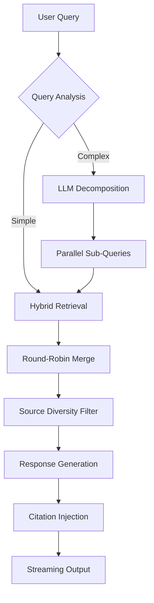

# ⚡ DEW21 Smart Energy Assistant

An advanced Retrieval-Augmented Generation (RAG) system designed for the energy sector, specifically optimized for **DEW21** (Dortmunder Energie- und Wasserversorgung GmbH). This platform provides high-precision, citation-backed answers regarding energy contracts, billing policies, and legal regulations in both **English** and **German**.

---

### 📜 Project Background
This project was developed as part of **The BIP: GenAI meets Reality** programme, organized by **Fachhochschule Dortmund (University of Applied Sciences and Arts)**. All data and use cases were provided by **DEW21** to explore the intersection of Generative AI and the energy industry.

---

## 🏗️ System Architecture: The 7-Phase Intelligence Pipeline

The system is built on a sophisticated asynchronous pipeline that ensures speed, accuracy, and source diversity.



1.  **Intelligent Query Decomposition**: Uses LLM-based analysis to split multi-part questions (e.g., "Compare Electricity vs Gas rights") into targeted sub-queries.
2.  **Hybrid Retrieval (Ensemble)**: Combines **FAISS** (Dense/Semantic) and **BM25** (Sparse/Keyword) with a 60/40 weighted distribution for maximum recall.
3.  **Keyword-Driven Source Boosting**: Explicitly triggers retrieval for smaller, high-priority documents (e.g., SCHUFA, Cost Overviews) when relevant keywords are detected.
4.  **Round-Robin Merging**: Interleaves results from sub-queries to ensure that secondary topics are not "drowned out" by the primary query's results.
5.  **Source Diversity Filter**: Caps the number of chunks per document to prevent long documents from monopolizing the context window, ensuring a balanced view.
6.  **Context-Aware Prompting**: Utilizes specialized system prompts for different **Response Modes** (Simplified, Standard, Expert).
7.  **Strict Grounding & Citations**: Enforces a "no-hallucination" policy where answers must be explicitly traceable to the retrieved context, complete with automatic source attribution.

---

## ✨ Key Features

*   🌍 **Multi-language Support**: Native English and German processing with a multilingual embedding backbone (**BGE-M3**).
*   🎓 **Expert Mode**: Specialized response engine that uses precise legal terminology and structured formatting (article citations, bullet-point breakdowns).
*   📊 **Evaluation Dashboard**: Built-in RAGAS-powered monitoring for **Accuracy**, **Faithfulness**, **Context Recall**, and **Hallucination Scores**.
*   ⚡ **Async Streaming**: Instant feedback via a threaded streaming architecture, reducing perceived latency to near-zero.
*   🔄 **Persisted Memory**: Complete chat history persistence with session-based title generation.

---

## 🛠️ Tech Stack

*   **Frontend**: Streamlit (Premium UI with Glassmorphism)
*   **LLM Orchestration**: LangChain Classic & LangChain Community
*   **Vector Database**: FAISS (Local storage)
*   **Keyword Engine**: BM25
*   **Embeddings**: BAAI/bge-m3 (Multilingual)
*   **LLM Model**: Qwen 2.5 (7B) / Llama 3.1
*   **Evaluation**: RAGAS Metrics Suite

---

## 🚀 Getting Started

### 1. Installation
Ensure you have Python 3.9+ installed.

```bash
# Clone the repository
git clone <repository-url>
cd dew21_project

# Create a virtual environment
python -m venv .venv
source .venv/bin/activate

# Install dependencies
pip install -r requirements.txt
```

### 2. Data Ingestion
Populate the vector database from source documents (English and German).

```bash
python src/ingest.py    # Process English documents
python src/ingest_de.py # Process German documents
```

### 3. Running the Application
Launch the main Streamlit interface.

```bash
streamlit run app.py
```

---

## 📈 Evaluation & Monitoring

To view the performance metrics and robustness sweeps:

```bash
streamlit run evaluation/dashboard.py
```

The dashboard tracks:
*   **Accuracy**: Alignment with ground truth.
*   **Faithfulness**: Minimal hallucination relative to retrieved context.
*   **Context Recall**: Effectiveness of the retrieval engine.
*   **Latency**: Per-request performance analysis.

---

## 📂 Project Structure

```text
├── app.py              # Main Application Entry Point
├── src/
│   ├── rag.py          # Core RAG Logic (Hybrid Retriever + LLM)
│   ├── ingest.py       # Data Processing (EN)
│   └── ingest_de.py    # Data Processing (DE)
├── evaluation/
│   ├── dashboard.py    # Performance Metrics UI
│   └── evaluate_rag.py # Batch Evaluation Logic
├── data/               # Source PDF/TXT Documents (EN)
├── data_de/            # Source PDF/TXT Documents (DE)
├── faiss_index/        # Vector Database (EN)
└── faiss_index_de/     # Vector Database (DE)
```

---

*Built with ❤️ for DEW21 Energy Intelligence.*
